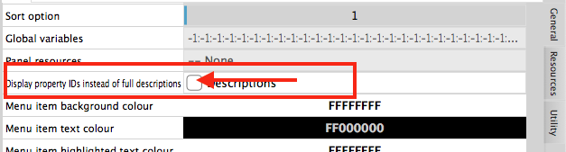

# How-to-get-a-Property-Value-from-a-LUA-script
>Damien S edited this page on Oct 24, 2023 · 1 revision

if you just want to get any modulator's property value in a script where "mod" is the modulator triggering the action, this is the way to go:
```lua
valueCustomNameGroup = mod:getProperty("modulatorCustomNameGroup") console("Displays valueCustomNameGroup : "..(valueCustomNameGroup))
```

In this case the property is attached to the "modulator".

if the property is related to the "componentGeneric" attributes, you need the extra getComponent() within the call:
```lua
valueGroupName = panel:getModulatorByName(ModName):getComponent():getProperty("componentGroupName") console("Displays valueGroupName : "..(valueGroupName))
```

If you want to get a value from a particular modulator that is not triggering the script (extrinsic):

First you need to select the modulator by its Modulator Name if the target modulator is outside the mod's script. In my following exemple it's (ModName) defined beforehand.

This would be the proper way to go :
```lua
componentPropertyValue = panel:getModulatorByName(ModName):getComponent():getProperty("componentPropertyName") 
```

For exemple :
```lua
valueGroupName = panel:getModulatorByName(ModName):getComponent():getProperty("componentGroupName")
console("Displays valueGroupName : "..(valueGroupName))
```
This will show your modulator value for property ID "componentGroupName"

the property IDs are shown if you tick "Display Property IDs instead of full descriptions"

Display Property IDs instead of full descriptions

https://private-user-images.githubusercontent.com/55164385/277558571-b5ffa8cd-8060-4633-8f20-1f35e714b707.png

You should be able to get any property values from any modulators this way.

Though, some parameters value requires to call Integers with getPropertyInt("") :
```lua
ParamCtrl1Index = panel:getModulatorByName(ModName):getPropertyInt("modulatorCustomIndex")
```