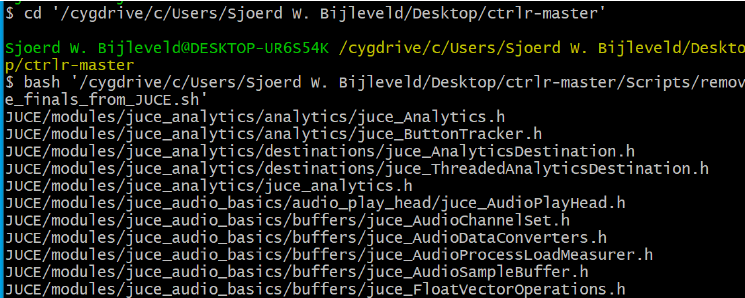
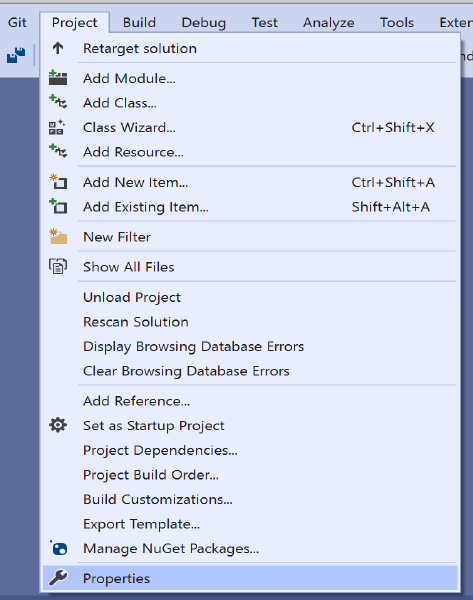
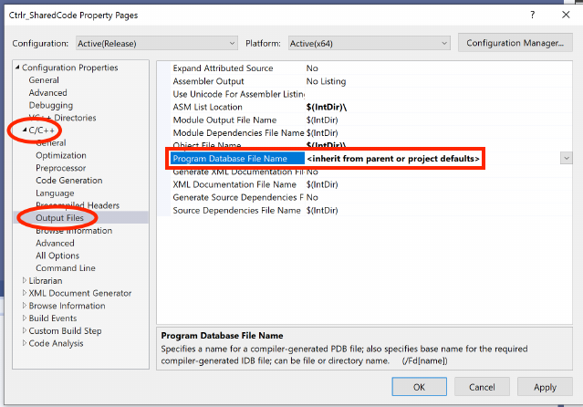
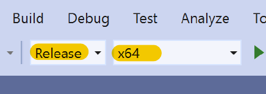
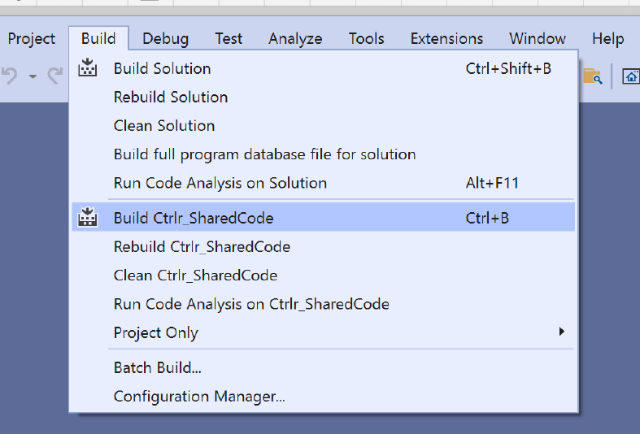

# Compiling Ctrlr: For Windows 10

#### Ported from a wonderfully crafted PDF by author `Sjoerd W Bijleveld`

- This document describes the steps I took to compile Ctrlr with Visual Studio 2019 on Windows 10.
- Disclaimer: I’m primarily a Mac/Apple user, so I’m probably not able to answer typical technical Windows/Visual Studio questions.
- Below is the About `Ctrlr` window of the compiled version.

The publishing date of this version is: April 8, 2021
My version of Visual Studio 2019 is: `16.9.4` and I installed it for the following 2 workloads:
   • Universal Windows Platform development;
   • Desktop development with C++.
I did use Windows 10 Pro English running virtual on my iMac with VMWare Fusion. I did use a fresh (but rather old) installment of `Windows 10` and before I could install and run `Visual Studio 19`, I had to do every update available for Windows 10. (My copy of Windows 10 dates back from August 2015 and was originally probable too old.)

## Download the Ctrlr source files
- The first thing you have to do of course is download the latest master from the `Ctrlr Github`[https://github.com/RomanKubiak/ctrlr]. First step you have to after downloading is unzipping `boost.zip`
- You will find this file in `..\ctrlr-master\Source\Misc\boost\`
- Just unzip it and do nothing further.

# Run shell scripts when compiler complains about "final"
- If the compiler complains you need to run shell scripts, otherwise you're lucky and may skip this part and continue with the section `Using the Projucer app`! 
- I refer to this comment of `Roman Kubiak`: [https://github.com/RomanKubiak/ctrlr/commit/c1f67d2f4033cb9f5dd20a123854fcddcd99b81d]
- This means that part of compiling `Ctrlr` is first running so called shell scripts (files with extension .sh). 
- These scripts only run in a Unix-like environment and from the terminal. 
- `Cygwin64` does provide this functionality for Windows, so first thing I had to do was installing `Cygwin64`: [https://cygwin.com]
- In the `Ctrlr` folder I found 2 .sh files. I decided to run both, because both seem to address the “final” issue.

# Running the shell scripts
- Open `Cygwin64 Terminal`. Type `cd` (without the quotes) and drag your `Ctrlr` folder into the terminal window and hit `ENTER`. This way you set the terminal to the `Ctrlr` directory.
- Next type ‘bash’, again without the quotes, and drag the script file ‘remove_finals_from_JUCE.sh (located in the scripts folder) into the terminal window and hit `ENTER`. A long list of files scrolls by. 
- The window looks like this:

- Do the same with the script file `remove_final.sh` found in the `JUCE` directory.
- I’m not sure if this is really needed, but it seemed not doing any harm.

## Using the Projucer app
- Projucer is needed as an intermediate step to load the `Ctrlr` project properly into `Visual Studio`. 
- So after you have downloaded and installed `JUCE` go to the `JUCE` folder, where you’ll find `Projucer.exe`. 
- Start the program.

## Building Ctrlr
- Before you export to Visual Studio make sure you set the right `global paths`.
- `Path to JUCE` is the path to the `Juce` folder in your `ctrlr-master` folder. 
- `Path to JUCE Modules` is the path to the modules folder inside the `Juce` folder of the `ctrlr-master` folder.

- Now choose `File>Open`... and pick the file: `\ctrlr-master\Ctrlr.jucer` 
- This file contains all the (source) files you need to build Ctrlr. Click on the export button of Projucer.
- `Visual Studio` will start and the Ctrlr project is loaded.

### Building the Ctrlr_SharedCode
- First step in building is to build the `Ctrlr_SharedCode`. 
- Before you can do the actual building you have to adjust some settings in `Visual Studio`. 
- The first one is the set the `Preferred Build Tool Architecture` to `64-bit (x64)`.

- Choose option `Properties` and in the `Properties` window `choose Advanced` and set the `architecture`:

- The second setting has to do with the so called `C/C++ Output File`. 
- Before you set this, make sure you have selected the `Ctrlr_SharedCode` item in the `Solution Explorer` side pane, because the setting will affect this item.

- Now go again to `Project>Properties` (the same menu option when setting the `Build Architecture`, see above) and choose `C/C++> Output Files>Program Database file Name`, and choose (or in case of not showing the text, type): `<inherit from parent or project defaults>`

- This has to be done because of the problem discussed here. 
- Click `OK` and set the build to `Release` and `x64`, you may choose otherwise:

- Next start the actual building:

- After a few minutes and many warnings, mostly of type `C4459`, if all is well the build succeeds. Next task is building the `Ctrlr_StandalonePlugin` project.

### Building Ctrlr_StandalonePlugin
- In fact the procedure for building this plugin is pretty much the same as for the `Ctrlr_SharedCode` project.
- First you select in the `Solution Explorer` the `Ctrlr_StandalonePlugin` item and then make sure that firstly the `Preferred Build Tool Architecture is set to 64-bit (x64)` as explained in the build for `Ctrlr_SharedCode` section above and secondly the `Program Database File Name for the C/C++ Output File` is set to
`<inherit from parent or project defaults>`
- After this settings you can build the plugin, which takes a rather long time, so be patient.
- If again all is well, the build succeeds. 
- You will find the generated `Ctrlr-x64.exe` in: `..\ctrlr-master\Builds\VisualStudio2019\x64\Release\Standalone Plugin\`
- So this is the build for `CTRLR 64-bit`. Building for `32-bit` does succeed only in Debug mode, but this build gives problems when running on a computer without `Visual Studio` installed or the proper redistributable `VC_redist.x86` for the `32-bit` architecture installed.
- (See my post further down in this thread about running the application without an installment of `Visual Studio`.)

## About this build
- I did test the application on my laptop with `Windows 7`, using a simple `USB MIDI` interface.
- The interface was connected to my `Kurzweil K2500R`.
- The panel for this instrument loaded OK and the `K2500R` responded as expected to the various sysex messages send from this panel.
- I will test this build further and keep you of course posted about my findings.
