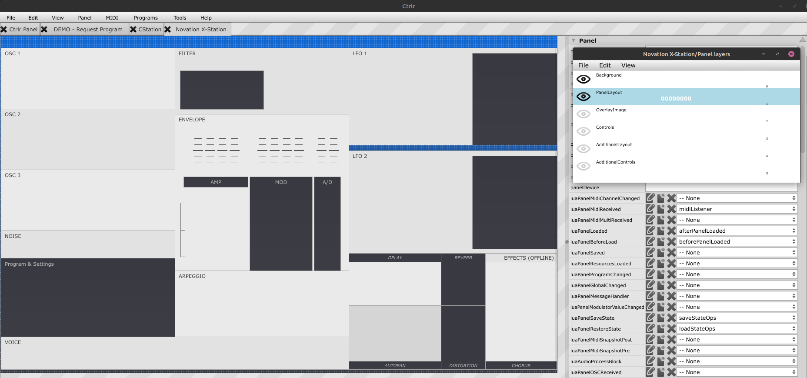

# xstation ui design


## Using UI Layers to simplify layout design, while maintaining flexible visibity settings

| Layer | Name | Function  | Description |
| -- | -- | -- | -- |
| 0 | Background | Background  | Main background image or color. Most will be covered up, so good place for panel `bezel` graphics, branding or border-placed logos |
| 1 | PanelLayout | Level-1B UI  | Level1 Panel partitioning & sections. NO controls, only visual aids helping user identify groups of controls in an intuitive way.  |
| 2 | OverlayImage |  Level-1A UI | Level1 Panel Depth/Overlay for 'hovering' logos, and additional panel elements for any complex visuals |
| 3 | Controls | Level-1 Controls | Level1 Controls ONLY. NO UI elements. |
| 4 | AdditionalLayout | Level-2 UI | Level2 Panel sections that will be stacked on TOP of Level1 assets |
| 5 | AdditionalControls | Level-2 Controls  | Level2 Panel Controls ONLY. NO UI elements.  |

<note class="red" >
Note: Ensure All layers visible by default(and when exporting!)?? Will objects initialize if hidden?
</note>

### Layer 5

### Layer 4

### Layer 3

### Layer 2

### Layer 1

### Layer 0


### Lua Editor
- all custom lua code will be placed in the editor
- the folder structure and names seem arbitrary to some extent, but why make it confusing:
  - for dedicated functions (ie: used once in the CtrlrPanelPropertyEditor only once)
    - set its name to match the property value: ie: `luaPanelLoaded()`
	- optionally, prefix the name with the Component's anme


- create a `new function`(ie `method`), by clicking 


<!-- 
 -->


## Startup Logic


### UI<->LuaMethods Panel Wiring: Start-Up

- A `Panel` is possibly the most active when it first loads as it must
  - read configuration settings
  - create the main `Panel/PanelEditor` window set and populate all of its properties
  - load 100's of modulators/components, read their saved properties, then update the UI state for each
  - create graphic objects & load their properties
  - open midi ports
- Part of that loading process that occurs simply by being `Ctrlr is USER-DEFINED` functions that are optionally set for any one of the numerous `hooks` available that `fire-off` when conditions are met.. most of these can be considered as `listeners`.
  - Ctrlr's application will call Events & these Events cry-out, with any Listener set to hear it will, in turn call a function.
  - These functions are specific in the Property Editor UI.
- This table shows functions set for the XStation Panel so far:

| id | text | type | functionName() |
| - | - | - | - |
| <note class="red">luaPanelMidiReceived</note> | Called when a panel `receives a MIDI message` | LuaMethod | <note class="red">midiListener()</note> |
| <note class="red">luaPanelLoaded</note> | Called when the panel has `finished loading` | LuaMethod        | <note class="red">afterPanelLoaded()</note> |
| <note class="red">luaPanelBeforeLoad</note> | Called `after core application is done loading` are created | LuaMethod      | <note class="red">beforePanelLoaded()</note> |
| <note class="red">luaPanelSaveState</note> | Called when `Ctrlr state is saved` (DAW saves a project)     | LuaMethod | <note class="red">saveStateOps</note> |
| <note class="red">luaPanelRestoreState</note> | Called when `Ctrlr is loaded` (DAW opens a project)       | LuaMethod | <note class="red">loadStateOps</note> |


### beforePanelLoaded
- Create a `boolean flag` to track if the panel is in a ready state: set to 0
- Create `Global vars`:
  - `additional flags` that track panel states (for charateristics that don't already have build-in parameters)
  - `initialize tables/arrays` for custom value storage, like initial control values, preset & bank lookups
  - `assign values to/from these tables/arrays` from hardware or panel elements/properties

#### startupMethods:beforePanelLoaded()
```lua
function beforePanelLoaded()
	local i
	-- Full load signal
	panelFullyLoaded = 0
	-- Show extra controls flag
	extraParamsMode = false
	-- Ready to get midi dump flag
	isGettingMidiDumpState = false
	selectedPresetNumber = 1
	-- MIDI dump temporary storage
	receivedProgramBytes = {}
	programBank = {}
	-- Initialising empty patch bank
	initPresetBank()
	-- Send panel data at startup flag
	sendDataOnStartup = false
	-- Send panel data on program change flag
	sendDataOnProgramChange = true
	-- New preset selected flag
	newPresetSelected = true
end
```

#### initMethods:initPresetBank()
```lua
function initPresetBank()
	local i
	for i =1, 100 do
		programBank[i] = getInitPatchData()
	end
end
```

#### initMethods:getInitPatchData()
```lua
function getInitPatchData()
	return {
		0xF0, 0x00, 0x20, 0x29, 0x01, 0x42, 0x7F, 0x00, 0x00, 0x10, 0x00, 0x00, 0x00, 0x30, 0x19, 0x00, 0x00, 
		0x40, 0x00, 0x15, 0x40, 0x40, 0x42, 0x40, 0x40, 0x40, 0x40, 0x40, 0x40, 0x40, 0x42, 0x40, 0x40, 0x40, 
		0x40, 0x40, 0x40, 0x40, 0x42, 0x40, 0x40, 0x40, 0x40, 0x40, 0x40, 0x40, 0x40, 0x49, 0x40, 0x40, 0x7F, 
		0x00, 0x00, 0x00, 0x00, 0x00, 0x00, 0x00, 0x40, 0x7F, 0x7F, 0x40, 0x40, 0x40, 0x40, 0x40, 0x40, 0x40, 
		0x40, 0x00, 0x40, 0x40, 0x00, 0x3C, 0x40, 0x02, 0x5A, 0x7F, 0x28, 0x40, 0x02, 0x41, 0x00, 0x41, 0x00, 
		0x44, 0x00, 0x32, 0x44, 0x00, 0x32, 0x00, 0x00, 0x3F, 0x40, 0x40, 0x40, 0x38, 0x03, 0x40, 0x00, 0x00, 
		0x00, 0x7F, 0x40, 0x40, 0x40, 0x0A, 0x00, 0x00, 0x00, 0x40, 0x64, 0x00, 0x40, 0x40, 0x00, 0x40, 0x7F, 
		0x00, 0x00, 0x40, 0x5A, 0x00, 0x40, 0x14, 0x00, 0x4A, 0x40, 0x40, 0x40, 0x14, 0x00, 0x00, 0x04, 0x00, 
		0x00, 0x00, 0x00, 0x00, 0x00, 0x02, 0x02, 0x02, 0x01, 0x01, 0x00, 0x00, 0x00, 0x00, 0x00, 0x00, 0x00, 
		0x00, 0x40, 0x40, 0x40, 0x40, 0x40, 0x40, 0x1C, 0x00, 0x00, 0x40, 0x49, 0x6E, 0x69, 0x74, 0x20, 0x50, 
		0x72, 0x6F, 0x67, 0x72, 0x61, 0x6D, 0x20, 0x20, 0x20, 0x20, 0x00, 0x00, 0x40, 0x40, 0x40, 0x40, 0x00, 
		0x00, 0x00, 0x07, 0x02, 0x00, 0x7F, 0x00, 0x00, 0x00, 0x7F, 0x40, 0x40, 0x00, 0x00, 0x00, 0x00, 0x00, 
		0x00, 0x00, 0x00, 0x00, 0x00, 0x00, 0x00, 0x00, 0x00, 0x00, 0x00, 0x00, 0x00, 0x00, 0x00, 0x00, 0x00, 
		0x00, 0x7F, 0x40, 0x40, 0x40, 0x40, 0x00, 0x2C, 0x00, 0x40, 0x20, 0x00, 0x7F, 0x02, 0x00, 0x01, 0x00, 
		0x00, 0x00, 0x00, 0x00, 0x04, 0x00, 0x00, 0x00, 0x00, 0x00, 0x00, 0x00, 0x05, 0x58, 0x40, 0x02, 0x11, 
		0x00, 0x00, 0x03, 0x00, 0x00, 0x00, 0x00, 0x22, 0x76, 0x7D, 0x5F, 0x2F, 0x5F, 0x7F, 0xF7}
end
```


### afterPanelLoaded
- check/set state flags as needed
- show splash graphics (a common practice to notify user that application is ready when its loading time can be long)
- show/flash version numbers or boot text
- NOW THAT `PANEL IS LOADED FULLY`, show/hide UI elements
  - this is where layers really simply both the design & managing the UI
  - a layer doesn't need to use the entire panel dimensions & could be as small at some slash text.
  - By grouping controls & UI objects on dedicated layers `INSTEAD` of nesting in groups
    - rearranging them is significantly more efficient & you wont be fighting against the UI with trying to enter into groups, then selecting objects
    - additionally the object coordinates will be `ABSOLUTE & not RELATIVE` significantly simplifying setting initial coords, but making the obligatory numerous adjustment as the design process unfolds
    - `SHOW/HIDE` for 100 objects can then be managed `BY ONE VALUE and ONE CALL`
- check/set any other state or init flags.


#### startupMethods:afterPanelLoaded()
```lua
function afterPanelLoaded()
	panelFullyLoaded = 0
	showGreeting()
	showHideExtraControls(false)
end
```

#### startupMethods:showGreeting()
```lua
function showGreeting()
	
	-- Show greeting
	panel:getComponent("lblProgramChanges"):setPropertyString("uiLabelDisplaysAllValues", "0")
	panel:getComponent("lblProgramChanges"):setText("X-Station Voice Editor")
end
```

#### panelMenu:showHideExtraControls(toShow)
- using boolean flag to manage layer/ui visibility
```lua
--- parse uiShow flags to hide any UI elements that should NOT be visible when panels starts & is ready
--- @param toShow boolean - single flag to manage multiple UI assets. 0 = hide | 1 = show
function showHideExtraControls(toShow)
	
	if toShow then

		panel:getCanvas():getLayerByName("AdditionalLayout"):setPropertyInt("uiPanelCanvasLayerVisibility", 1)
		panel:getCanvas():getLayerByName("AdditionalControls"):setPropertyInt("uiPanelCanvasLayerVisibility", 1)
	else

		panel:getCanvas():getLayerByName("AdditionalLayout"):setPropertyInt("uiPanelCanvasLayerVisibility", 0)
		panel:getCanvas():getLayerByName("AdditionalControls"):setPropertyInt("uiPanelCanvasLayerVisibility", 0)
	end
end
```


<!-- this style is NOT honored on github, but is a local IDEs -->
<style type="text/css">.red{color:red;font-size:16px; background-color:#111111} </style>